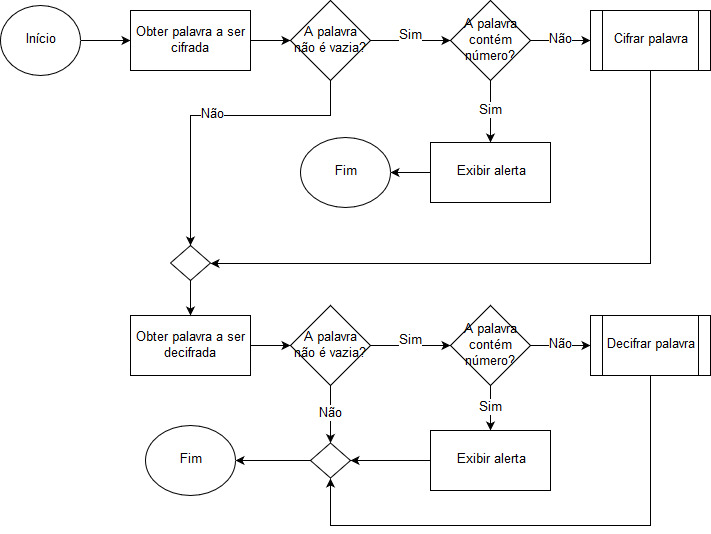

Cifra de César em Javascript
=============================

1. Obter palavra a ser cifrada via 'prompt';
2. Validar se a palavra não é vazia;
3. Se a validação for falsa, obter palavra a ser decifrada via segundo 'prompt';
4. Se a validação for verdadeira, validar se a palavra contém número;
5. Se a palavra contém número, exibir alerta via 'alert';
6. Se a palavra não contém número, cifrar a palavra via 'function cipher';
7. Obter palavra a ser decifrada via 'prompt';
8. Validar se a palavra não é vazia;
9. Se a validação for falsa, não executar nada;
10. Se a validação for verdadeira, validar se a palavra contém número;
11. Se a palavra contém número, exibir alerta via 'alert';
12. Se a palavra não contém número, decifrar a palavra via 'function decipher';

Fluxograma
---------------------------------------------------------------

